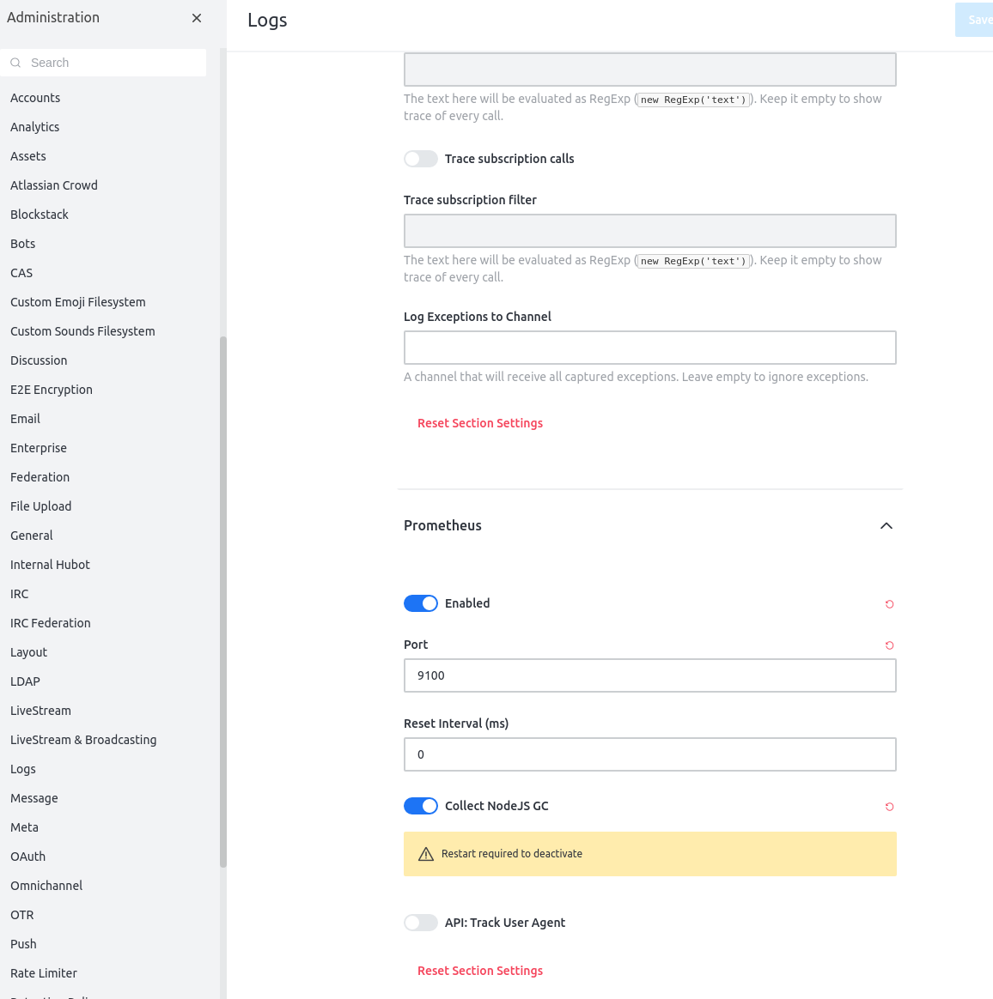

# Rocket.Chat.Monitoring
Easy ad-hoc monitoring of a single or multiple Rocket.Chat servers

## Monitoring your existing server(s)

So you have a few Rocket.Chat servers running for your family and friends, perhaps for your office or special interest group.
You've always wanted some way to "look inside" these servers and monitor their health during operations but fell short of doing something about it.

This project will help you to realize that goal.   It will show you step by step how to setup monitoring for your existing Rocket.Chat server.  

It is assumed that you may have deployed your running Rocket.Chat servers using manual or docker or snap methods.   The "monitoring tools" and "stack" will be deployed via docker-compose.

This is a manual, ad-hoc, setup for Rocket.Chat server(s) running on one single machine/VM/VPS/swarm.  If you are clustered and/or are already using orchestration platforms such as Kubernetes, this project will not be useful for you. 

The monitoring stack used in this project is adaptive to all platforms and can easily run even on a Raspberry Pi 4 - 4GB.

###  Pre-requisites

*  the latest supported docker and docker-compose installed and working for your platform (on Ubuntu 18.04 LTS and later, `snap install docker` )


#### 1.  Prepare your Rocket.Chat servers to expose metrics

For security reasons, Rocket.Chat servers do not expose any operational metrics by default.  You must turn it on. 

For each server you want to monitor, sign in as administrator and then go to Administration -> Logs -> Prometheus and make sure you **enable** it and remember the default port used.  Save your changes.



#### 2.   Create monitoring network and add server containers (for docker deployed servers)

If your server(s) are deployed using docker on your multi-cores machine/vps, then create a monitoring network:

```
docker network create monitoring
```

And then connect the server(s) that you want to be monitored to this network, issuing this command for each running server container:

```
docker network connect monitoring <<container name>>
```

Where ``<<container name>>`` is the name or id of the container currently running Rocket.Chat.

Once you've added all your server containers to the monitoring network, confirm it using:

```
docker network inspect monitoring
```

You should see all your containers listed as connected to monitoring network
